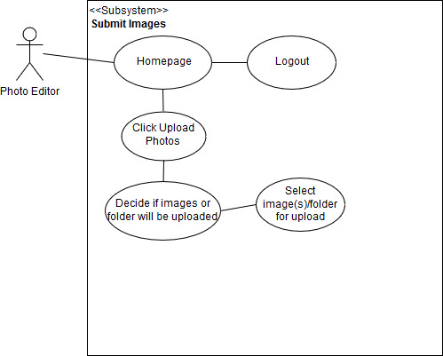

Link to Application: http://3.14.73.158/

Use Case Description

Use Case 1: Submitting Images to System

Description:

- The Photo Editor logs into the system and submits an image(s)/folder the system

Triggers:
- Click Upload Photos button 
- Select whether files or folders will be uploaded
- Click File Chooser button
- Select Image(s) or Folder to submit
- Click Rate Photos button

Actors

- Photo Editors

Preconditions

- Photo Editor has an account registered to the system and image(s) or a folder of images in his/her device for submitting to the system

Main Success Scenario

- The user chooses to submit an image(s) or folder to the system
- The user clicks Upload Phtos button
- The user decides whether files or a folder will be uploaded
- The user selects image that will be submitted to the system 
- The user clicks Rate Photos

Failed End Condition

- User does not select image(s)/folder to upload before clicking Rate Photos button

Steps of Execution

- When the user reaches the system's homepage, the user clicks the Upload Photos button. When the Upload Photos button is clicked, the user decides whether individual images will be uploaded or a folder will be uploaded. Then the user selects the image(s)/folder that will be uploaded. The user clicks Rate Photos button.

Content: Milesh Shah

Peer Review: Joshua Thompson

Use Case Description

Use Case 2: Download Images

Description:

- The user logs in to the site, uploads and submits images and downloads images of a particular category that receive at least the rating specified by the user

Triggers:

- Select Wanted Categories
- Select Minimum Rating Wanted
- Click images that will be downloaded or click Download All button to download all images

Actors

- Photo Editors
- System Admin

Preconditions

- Photo Editor has an account registered to the system
- Photo Editor has submitted images to the system for rating

Main Success Scenario

- Photo Editor enters Username and Password
- He or She submits login form
- If credentials are valid, then he or she is redirected to the site homepage where they have access to the system interior
- The user clicks onto the download images webpage
- The user selects the categories they want to pull images for
- The user selects the minimum rating they want to pull images for
- The user chooses the image(s) they would like to download
- The user downloads the image(s)

Failed End Condition

- No images match the user request

Steps of Execution

- The Photo Editor connects to the login page, submits the login form and gets access to the login page. The user chooses to go to the download images webpage and selects the categories and the minimum rating they want to pull images for. From there, the user will be shown all of the images that match their request, where they will be able to choose the image(s) they would like to download. There will also be a download all option so that the user can quickly download all of the images that match their request. Once the user is ready, they will click the images that he or she wwants to download to download the images.

Content: Christopher Foeller

Peer Review: Joshua Thompson, Milesh Shah

.jpg)

Use Case Description

Use Case 3: Filtering Images

Description: 

- The user, photo editor filters the images, that is the user selects which images will be downloaded based on their rating and category

Triggers:

- Submitting image for rating
- Choosing category of Image
- Selecting minimum rating of image
- Click submit button to only display only images that meet criteria specified by the user

Actors

- Photo Editors

Preconditions

- Photo editor has an account in the system
- Photo editor has images/folder for submission
- Photo editor has submitted images for rating
- Images have been rated

Main Success Scenario 

- Photo Editor goes to home page
- Photo editor submits image/folder
- Images are submitted and rated
- Photo editor selects images based on rating and category

Failed End Condition

- No images match the rating the user requests

Steps of Execution

- The Photo Editor connects to the home page. There the user decides to submit and image for rating.  The user selects the images/folder that will be submitted and submits the images. Then the submitted images are rated and the rating is put as the image’s metadata and then the user selects the images based on their rating.

Purpose\Goal: Create a classifier that can determine which photos are of good quality and which photos are not of good quality on a sliding scale

Interface : Web interface

// additional feature after initial version

// initial build will keep the addition of this later functionality in mind

Photo editors will contribute to the supervised learning of the model

Workflow of System

- Login
- Submit folder of images to system
- User is displayed a wall of the images that each show a rating
  - Can filter and sort based on given ratings and category
  - Can download images based on rating
- Logout

Use Cases :

- Submit images to system:

1. Click Upload Photos button
2. Decide whether image(s) or a folder will be uploaded
3. Select files or folder that will be uploaded
4. Click Rate Photos button

- Download Images:

1. User can download images over a specified rating received for an images and the image's category
2. User specifies the rating that an image must receive  and the category of image so that it may be downloaded

- Filtering Images:

1. User puts image's rating and category as metadata
2. User chooses images based on their rating and category
