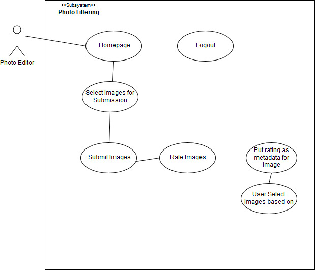

Use Case Description

Use Case 1: Submitting Images to System

Description:

- The Photo Editor logs into the system and submits an image of a category to the system

Triggers:

- Click File Chooser button
- Select Image or Folder to submit
- Drag Image or folder for submission
- Submit image/folder to the system

Actors

- Photo Editors

Preconditions

- Photo Editor has an account registered to the system and images of a particular category in his/her device for submitting to the system

Main Success Scenario

- The user chooses to submit an image or folder to the system
- The user chooses the category of image that will be submitted
- The user clicks file chooser button
- The user selects image that will be submitted to the system or drags and drops the image that will be submitted

Failed End Condition

- Photo does not belong to the category the user selected

Steps of Execution

- The user chooses to submit an image to the system. The user decides what the category of the image that will be submitted is. The user is in the submission page where he or she clicks on the file chooser to pick and image or folder that will be selected or dragged to the page for submission. The user clicks the submit button to submit the image. The system returns a number that trates the picture

Content: Milesh Shah

Peer Review: Joshua Thompson

Use Case Description

Use Case 2: Download Images

Description:

- The user logs in to the site, and is able to select images for a given category and downloads images that receive at least the rating specified by the user

Triggers:

- Select Wanted Categories
- Select Minimum Rating Wanted
- Select Images to Download

Actors

- Photo Editors
- System Admin

Preconditions

- Photo Editor has an account registered to the system
- Photo Editor has submitted images to the system for rating

Main Success Scenario

- Photo Editor enters Username and Password
- He or She submits login form
- If credentials are valid, then he or she is redirected to the site homepage where they have access to the system interior
- The user clicks onto the download images webpage
- The user selects the categories they want to pull images for
- The user selects the minimum rating they want to pull images for
- The user chooses the image(s) they would like to download
- The user downloads the image(s)

Failed End Condition

- No images match the user request

Steps of Execution

- The Photo Editor connects to the login page, submits the login form and gets access to the login page. The user chooses to go to the download images webpage and selects the categories and the minimum rating they want to pull images for. From there, the user will be shown all of the images that match their request, where they will be able to choose the image(s) they would like to download. There will also be a select all option so that the user can quickly download all of the images that match their request. Once the user is ready, they will hit the download button to start the download of the images they selected.

Content: Christopher Foeller

Peer Review: Joshua Thompson, Milesh Shah

Use Case Description
Use Case 3: Filtering Images
Description: 
- The user, photo editor filters the images, that is the user selects which images will be downloaded based on their rating
Triggers:
- Choosing category of Image
- Submitting image for rating
- Using rating as metadata for image
- Select image based on rating
Actors
- Photo Editors
Preconditions
- Photo editor has an account in the system
- Photo editor has images for submission
- Photo editor has submitted images for rating
- Images have been rated
Main Success Scenario 
- Photo Editor goes to home page
- Photo editor chooses category of image to submit
- Photo editor submits image
- Images are submitted and rated
- Photo editor selects images based on rating 
Failed End Condition
- No images match the raating the user requests
Steps of Execution
- The Photo Editor connects to the home page. There the user decides to submit and image for rating. The user first selects the category of image for rating. Then the user selects the images that will be submitted and submits the images. Then the submitted images are rated and the rating is put as the image’s metadata and then the user selects the images based on their rating.

Purpose\Goal: Create a classifier that can determine which photos are of good quality and which photos are not of good quality on a sliding scale

Interface : Web interface

// additional feature after initial version

// initial build will keep the addition of this later functionality in mind

Photo editors will contribute to the supervised learning of the model

Workflow of System

- Login
- Submit folder of images to system
  - (optional) select category of images ex. Football, Pop-News, Mixed (default), etc.
- User is displayed a wall of the images that each show a rating
  - Can filter and sort based on given ratings
  - Can download images based on rating
- Logout

Use Cases :

- Submit images to system:

1. Select Category of Image
2. Drag and Drop Image/ Folder

- Download Images:

1. User can download images over a specified rating received for an images
2. User specifies the rating that an image must receive so that it may be downloaded
